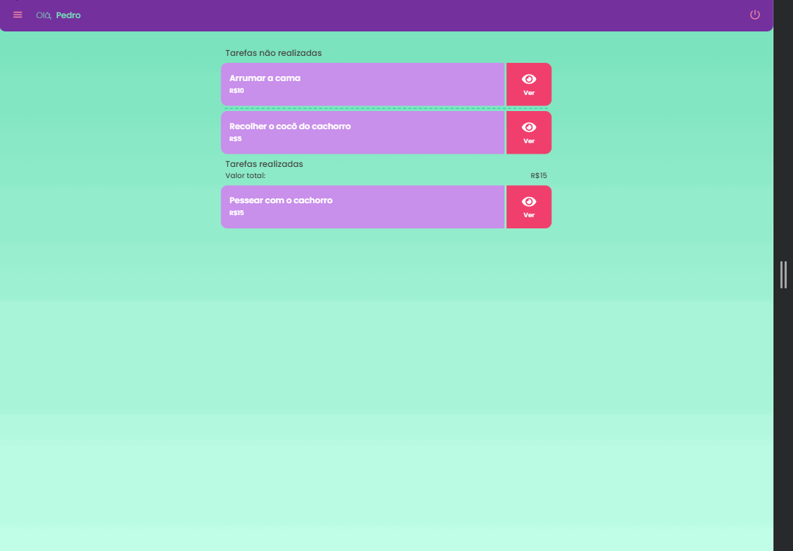

  

<h1 align="center">Task management app for kids</h1>

### 👨🏻‍💻 Run:

~~~node
  npm run dev
~~~

### 👀 Deploy:
<http://34.228.223.216:5173/>

### 📱Prototype:

[Click here!](https://www.figma.com/file/esTd4CMgUpxCsB7WK6H5op/SGTC---Prototype?type=design&node-id=1272%3A946&mode=design&t=qnHutrOiyMpJX4ey-1)

## Tecnologies:

### Front-End

  

### Back-End

[👉🏻 Back-end repository](https://github.com/Matheus-Juliao/projeto-integrador)

  

### Database

  

### Rest client:

  

### Screens

#### Responsivity

    

        
        
    

#### Mobile

    

        
        
    

##

<strong>Developed by:</strong>

  
  
  
  
  
  
  

